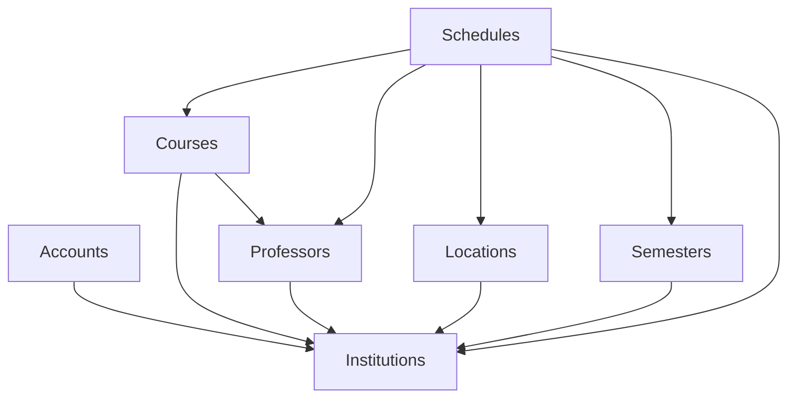

# معماری Unischedule

این سند خلاصه‌ای از مسئولیت‌های هر اپلیکیشن در پروژه و نحوهٔ ارتباط آن‌ها با یکدیگر ارائه می‌دهد.

## accounts
- **مسئولیت‌ها:** مدیریت کاربران و احراز هویت.
- **مدل‌های اصلی:** `User` که از `AbstractUser` ارث‌بری کرده و به `Institution` متصل است.
- **وابستگی‌ها و تعامل:** برای تعیین محدوده دسترسی کاربران به `Institution` تکیه دارد.

## institutions
- **مسئولیت‌ها:** تعریف مؤسسات آموزشی.
- **مدل‌های اصلی:** `Institution`.
- **وابستگی‌ها و تعامل:** پایه‌ای برای سایر اپ‌ها که به مؤسسه وابسته هستند (کاربران، دروس، ساختمان‌ها، استادان و ...).

## professors
- **مسئولیت‌ها:** مدیریت اطلاعات اساتید.
- **مدل‌های اصلی:** `Professor` که به `Institution` مرتبط است.
- **وابستگی‌ها و تعامل:** توسط `courses` و `schedules` برای تخصیص اساتید به دروس و جلسات استفاده می‌شود.

## courses
- **مسئولیت‌ها:** مدیریت دروس ارائه‌شده.
- **مدل‌های اصلی:** `Course` که به `Institution` و `Professor` وابسته است.
- **وابستگی‌ها و تعامل:** `schedules` برای برنامه‌ریزی جلسات کلاس از آن استفاده می‌کند.

## locations
- **مسئولیت‌ها:** تعریف ساختمان‌ها و کلاس‌های آموزشی.
- **مدل‌های اصلی:** `Building`, `Classroom`.
- **وابستگی‌ها و تعامل:** ساختمان‌ها به `Institution` وابسته‌اند و کلاس‌ها به ساختمان‌ها. `schedules` از کلاس‌ها استفاده می‌کند.

## semesters
- **مسئولیت‌ها:** مدیریت ترم‌های تحصیلی.
- **مدل‌های اصلی:** `Semester` مرتبط با `Institution`.
- **وابستگی‌ها و تعامل:** `schedules` جلسات را در چارچوب ترم ثبت می‌کند.

## schedules
- **مسئولیت‌ها:** زمان‌بندی جلسات کلاس‌ها.
- **مدل‌های اصلی:** `ClassSession` شامل ارجاع به `Course`, `Professor`, `Classroom`, `Semester` و `Institution`.
- **وابستگی‌ها و تعامل:** مرکز هماهنگی داده‌ها بین اپ‌ها و به تمامی اپ‌های بالا وابستگی مستقیم دارد.

